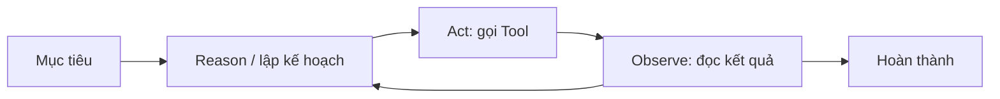
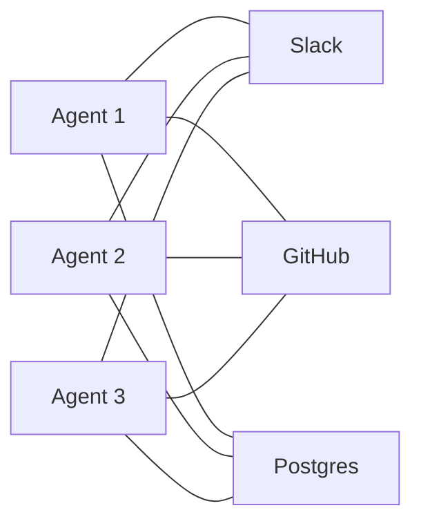
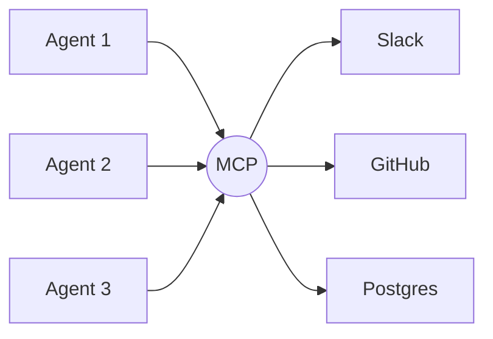

# AI → LLM → Agent → **MCP**

Từ AI biết *nói* đến AI biết *làm* — và vì sao cần một "USB-C cho AI".

<div class="mt-4 text-sm opacity-70">
Buổi chia sẻ kiến thức · 2026-05-27
</div>

<!--
Hook mở đầu: 2 năm trước AI chỉ trả lời; giờ AI tự đặt vé, sửa code, query DB.
Điều gì đã thay đổi? Câu trả lời nằm ở "tools" — và bài toán quản lý chúng.
-->

---
layout: default
---

# Hành trình hôm nay

- **Phần 1** — AI → LLM → Agent: *vì sao* mỗi nấc xuất hiện
- **Cầu nối** — Bên trong Agent: <Tag>tools</Tag> và bài toán bùng nổ tích hợp
- **Phần 2** — **MCP**: chuẩn hoá kết nối, biến **M×N → M+N**

<Spotlight label="Thông điệp cốt lõi" class="mt-6">
Agent mạnh lên nhờ <strong>tools</strong>. Nhưng tools nhiều lên thì tích hợp vỡ trận —
<strong>MCP</strong> chuẩn hoá lớp kết nối để mọi agent dùng chung mọi tool.
</Spotlight>

---
layout: section
number: "01"
background: /images/01-abstract-futuristic-digital-and-technolo.jpg
---

# AI → LLM → Agent

Ba nấc tiến hoá, mỗi nấc phá một giới hạn.

---
layout: default
---

# Nấc 1 — AI cổ điển & Machine Learning

- AI "truyền thống": **luật tay** (rule-based) — giòn, không tổng quát hoá
- **Machine Learning**: học quy luật *từ dữ liệu* thay vì lập trình từng luật
- Nhưng: **mỗi bài toán = một model riêng** (phân loại ảnh, dịch máy, gợi ý…)

<Spotlight label="Giới hạn" tone="accent" class="mt-4">
Không có một mô hình "đa năng" — đổi bài toán là phải gom dữ liệu và train lại từ đầu.
</Spotlight>

---
layout: default
---

# Nấc 2 — Sự trỗi dậy của LLM

- **2017**: kiến trúc <Tag>Transformer</Tag> ("Attention is All You Need")
- **Scaling**: thêm dữ liệu + tham số + compute → năng lực tổng quát bất ngờ
- Sinh ra **foundation models** (GPT, Claude, Gemini…): *một* model, *nhiều* việc

<div class="text-sm opacity-70 mt-4">
LLM = bộ dự đoán <strong>token</strong> kế tiếp, học từ lượng văn bản khổng lồ.
</div>

---
layout: default
---

# LLM giỏi *nói* — nhưng chưa biết *làm*

- Kiến thức **đóng băng** tại thời điểm train — không biết chuyện mới
- Không truy cập được **dữ liệu riêng** của bạn (DB, file nội bộ, API)
- Chỉ sinh **văn bản** — tự nó không thể đặt lịch, gọi API hay chạy code

<Spotlight label="Khoảng trống" class="mt-4">
Cần một cách để LLM <strong>hành động</strong> ra thế giới thực → đây là lúc
<strong>tool calling</strong> và <strong>agent</strong> xuất hiện.
</Spotlight>

---
layout: default
---

# Nấc 3 — Từ chatbot đến **AI Agent**

Agent = LLM đặt trong vòng lặp **reason → act → observe**, có quyền dùng tools.



<div class="text-sm opacity-70 mt-2">
LLM tự quyết định <em>gọi tool nào, với tham số gì</em>, rồi dùng kết quả để bước tiếp.
</div>

---
layout: section
number: "02"
---

# Bên trong một Agent

Thành phần, vai trò của **tools**, và bài toán bắt đầu lộ ra.

---
layout: image-right
image: /images/08-rise-of-the-planet-of-the-agents-creatin.png
---

# Bốn thành phần của một Agent

- **🧠 LLM — bộ não:** suy luận, ra quyết định
- **🗺️ Reasoning / Planning:** chia mục tiêu thành các bước
- **💾 Memory:** ngữ cảnh ngắn hạn + dài hạn
- **🔧 Tools — tay chân:** đọc/ghi thế giới thực (API, DB, file, web)

<Spotlight label="Mấu chốt" class="mt-3">
LLM là bộ não, nhưng <strong>tools</strong> mới biến "biết nói" thành "biết làm".
</Spotlight>

---
layout: default
---

# Tools — cây cầu ra thế giới thực

- Mỗi tool = một **hàm có schema**: tên, mô tả, tham số đầu vào
- Ví dụ: `search_web`, `query_db`, `send_email`, `create_ticket`…
- LLM đọc danh sách tool → chọn tool → app **thực thi** → trả kết quả về

```ts
interface Tool {
  name: string                 // "query_db"
  description: string          // LLM đọc để biết khi nào dùng
  inputSchema: JSONSchema      // tham số hợp lệ
  run(args: unknown): Promise<Result>
}
```

---
layout: default
---

# Càng nhiều tool → tích hợp **vỡ trận**

Mỗi app/dịch vụ tự định nghĩa tool & cách kết nối riêng → **bài toán M×N**.



<div class="text-sm opacity-70 mt-1">
M agent × N tool = M×N bản tích hợp viết tay. 3 × 3 = 9… và nó còn phình to.
</div>

---
layout: default
---

# Hệ quả: trùng lặp & khó quản lý

- **Trùng lặp**: mỗi đội viết lại connector cho cùng một dịch vụ
- **Không chuẩn**: mỗi tích hợp một kiểu auth, một format, một cách báo lỗi
- **Khó khám phá / quản trị**: tool nào đang có? ai được dùng? cập nhật ra sao?
- Đổi 1 API → sửa **mọi** agent đang gọi nó

<Spotlight label="Câu hỏi" class="mt-4">
Nếu USB từng thống nhất "muôn vàn đầu cắm", liệu có một <strong>chuẩn chung</strong>
cho việc nối AI với dữ liệu & công cụ?
</Spotlight>

---
layout: section
number: "03"
---

# MCP — *USB-C cho AI*

Model Context Protocol: một chuẩn, nối mọi agent với mọi tool.

---
layout: default
---

# MCP là gì?

- **Model Context Protocol** — chuẩn **mở**, Anthropic công bố **11/2024**
- Chuẩn hoá cách **AI app ↔ dữ liệu & công cụ** kết nối với nhau
- Ẩn dụ: <Tag variant="solid">USB-C cho AI</Tag> — một cổng, cắm được mọi thứ

<Spotlight label="Quan trọng" class="mt-4">
MCP <strong>không</strong> phải model hay framework agent mới. Nó là <strong>giao thức
kết nối</strong> — vai trò giống HTTP với web.
</Spotlight>

<!--
Nhấn: MCP nằm ở "lớp kết nối", không thay thế LLM hay LangChain/SDK.
-->

---
layout: image-right
image: /images/05-what-is-model-context-protocol-mcp-a-gui.png
---

# Kiến trúc: Host · Client · Server

- **Host**: app AI (Claude, IDE, ChatGPT…), điều phối nhiều client
- **Client**: giữ kết nối **1-1** tới một server
- **Server**: chương trình *cấp* tools & dữ liệu
- **Transport**: **stdio** (local) hoặc **HTTP** (remote)

<div class="text-sm opacity-70 mt-3">
Một host → nhiều client; mỗi client nối tới một server riêng.
</div>

---
layout: two-cols-header
---

# Hai lớp & các "primitives"

::left::

**Data layer** — JSON-RPC 2.0

Vòng đời, thương lượng năng lực, và các primitives.

Server cung cấp:
- **Tools** — hàm để *hành động*
- **Resources** — dữ liệu/ngữ cảnh
- **Prompts** — mẫu tương tác

::right::

**Transport layer**
- **stdio** — tiến trình local
- **Streamable HTTP** — remote (+ OAuth)

Client cung cấp:
- **Sampling**, **Elicitation**, **Logging**

::bottom::

<div class="text-sm opacity-70 mt-3">
Cùng một format JSON-RPC chạy trên mọi transport — server không cần quan tâm.
</div>

---
layout: default
---

# Khám phá tool **động**

Client hỏi server có tool gì (`tools/list`), rồi gọi (`tools/call`).

```json
{ "jsonrpc": "2.0", "id": 2, "method": "tools/list" }
```

- Server đổi tool → gửi `notifications/tools/list_changed`
- Client tự cập nhật → LLM thấy ngay năng lực mới, **không cần code lại**

<div class="text-sm opacity-70 mt-2">
Đây là khác biệt lớn so với tool nhúng cứng: danh sách tool là <em>dữ liệu</em>, không phải code.
</div>

---
layout: two-cols-header
---

# Lời giải: M×N → **M+N**

::left::

**Trước MCP**
- Mỗi cặp (agent, tool) một tích hợp
- 3 agent × 100 tool = **300** bản tay
- Đổi 1 tool → sửa khắp nơi

::right::

**Với MCP**
- Viết **server 1 lần** → mọi host dùng
- Viết **client 1 lần** → mọi server dùng
- 3 + 100 = **103** mảnh ghép

::bottom::



---
layout: default
---

# Hệ sinh thái 2025 → 2026

- **03/2025**: OpenAI áp dụng MCP (ChatGPT, SDK)
- **04/2025**: Google DeepMind xác nhận hỗ trợ trong Gemini
- **Microsoft**: tích hợp vào VS Code & Azure
- **10.000+** MCP server công khai; hàng trăm Fortune 500 triển khai
- **12/2025**: Anthropic chuyển MCP cho **Agentic AI Foundation** (Linux Foundation)

<Spotlight label="Ý nghĩa" class="mt-3">
MCP đã thành <strong>chuẩn de-facto</strong> để nối AI với thế giới thực — trung lập, đa nhà cung cấp.
</Spotlight>

---
layout: default
---

# Hiểu lầm thường gặp

- ❌ *"MCP là một AI/agent mới"* → MCP chỉ là **giao thức kết nối**
- ❌ *"Có MCP là hết cần framework agent"* → MCP **bổ trợ**, không thay LangChain/SDK
- ❌ *"MCP server luôn chạy trên cloud"* → có thể chạy **local** (stdio) hoặc remote

---
layout: quote
author: "Ẩn dụ phổ biến về MCP"
---

Trước USB-C, mỗi thiết bị một đầu cắm. MCP làm điều tương tự cho AI: **một chuẩn**, nối mọi mô hình với mọi công cụ.

---
layout: default
---

# Tổng kết

**AI → LLM → Agent → MCP**: mỗi nấc phá một giới hạn.

- LLM cho AI khả năng **ngôn ngữ & lý luận** tổng quát
- **Tools** biến LLM "biết nói" thành agent "biết làm"
- Tools bùng nổ → **M×N** → **MCP** chuẩn hoá về **M+N**

<Spotlight label="Thử ngay" class="mt-4">
Cắm một MCP server (filesystem / GitHub) vào Claude hoặc IDE của bạn, xem agent
"khám phá" tool và dùng — chỉ trong vài phút.
</Spotlight>

---
layout: default
class: text-sm
---

# Nguồn ảnh & tham khảo

**Ảnh** (tìm từ web — bản quyền hỗn hợp, dùng nội bộ; chi tiết: `public/images/credits.json`):
- Nền AI/tech — Vecteezy
- Sơ đồ MCP — DevDash Labs, *What is Model Context Protocol*
- Thành phần agent — Open Threat Research, *Rise of the Planet of the Agents*

**Nội dung**:
- modelcontextprotocol.io — Architecture overview
- Wikipedia — Model Context Protocol
- Anthropic — Donating MCP to the Agentic AI Foundation

---
layout: end
---

# Cảm ơn!

Hỏi đáp · Q&A
